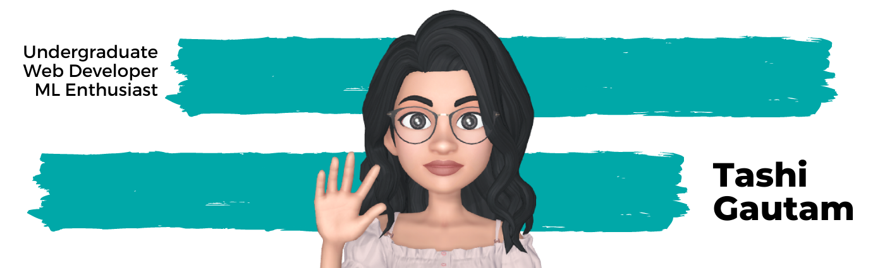

### Hi, I'm Tashi! 👋

- <i>Currently:</i> Pre-final year student at Ajay Kumar Garg Engineering College. 

I am a Full Stack Developer and Machine Learning Enthusiast. Passionate about learning new inventive technologies to elevate spirits and build communities ❤️. Some technologies I enjoy working with include ReactJS, VueJS, NodeJS, and MongoDB. Languages I hold knowledge about are HTML, SCSS, Javascript, Python, and C++. I am chosen as the ⭐ Google Developer Student Club Lead, AKGEC 2021-2022. ⚡ Outside Tech, I love to dance, swim, enjoy music, and explore nature outdoors.

<h2>😄 Pronouns:</h2>

- she/her/hers

<h2>💻 I'm Currently Learning</h2>

__UX Desigining__

- [Google UX Design Professional Certificate](https://www.coursera.org/professional-certificates/google-ux-design?utm_source=gg&utm_medium=sem&utm_campaign=15-GoogleUXDesign-IN&utm_content=15-GoogleUXDesign-IN&campaignid=12609829815&adgroupid=120289736576&device=c&keyword=google%20ux%20certification&matchtype=b&network=g&devicemodel=&adpostion=&creativeid=509135993273&hide_mobile_promo&gclid=CjwKCAjw47eFBhA9EiwAy8kzNEjkz0ZAHvM8rGrg5b7uinYm1JEb2RkarWdYCeNg1LSkzFPFoZFfAxoC5N4QAvD_BwE)

<h2>👯 I’m looking to collaborate with</h2>

Technophiles who wish to build amazing projects blending machine learning with web developemnt.

<h2>📫 How to reach me:</h2>

<!--
**tashi2408/tashi2408** is a ✨ _special_ ✨ repository because its `README.md` (this file) appears on your GitHub profile.

Here are some ideas to get you started:

- 🔭 I’m currently working on ...
- 🌱 I’m currently learning ...
- 👯 I’m looking to collaborate on ...
- 🤔 I’m looking for help with ...
- 💬 Ask me about ...
- 📫 How to reach me: ...
- 😄 Pronouns: ...
- ⚡ Fun fact: ...
-->
